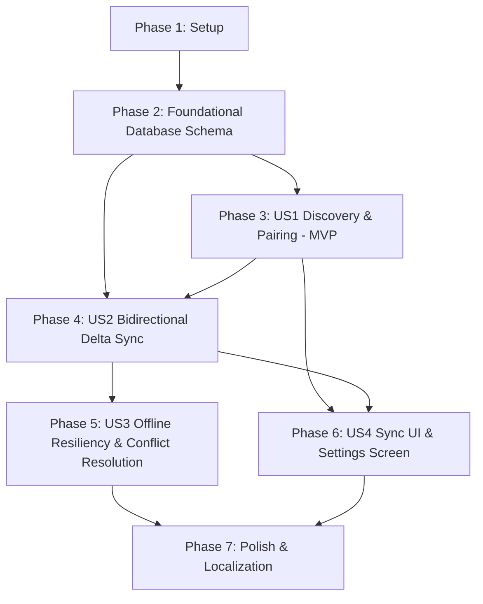

# Tasks: Local Wi-Fi Sync with KDE Plasmoid Desktop

**Input**: Design documents from `specs/015-desktop-companion-sync/`
**Prerequisites**: [plan.md](plan.md), [spec.md](spec.md), [research.md](research.md), [data-model.md](data-model.md), [contracts/sync-protocol.json](contracts/sync-protocol.json), [contracts/mobile-sync-api.md](contracts/mobile-sync-api.md)

## Format: `[TaskID] [P?] [Story?] Description with file path`

- **[P]**: Can run in parallel (different files, no dependencies)
- **[Story]**: Which user story this task belongs to (`US1`, `US2`, `US3`, `US4`)

---

## Phase 1: Setup (Shared Infrastructure)

**Purpose**: Dependencies and baseline DTO definitions

- [X] T001 Add OkHttp dependency to `app/build.gradle.kts`
- [X] T002 [P] Create DTO data classes matching `bookmarks-sync-v1` schema in `app/src/main/java/com/madruga665/bookmarks/data/remote/sync/dto/SyncDto.kt` and `app/src/main/java/com/madruga665/bookmarks/data/remote/sync/dto/PairDto.kt`

---

## Phase 2: Foundational (Blocking Prerequisites)

**Purpose**: Persistence schema updates and DAO foundations (CRITICAL - blocks all user stories)

- [X] T003 Update `CollectionEntity` and `BookmarkEntity` in `app/src/main/java/com/madruga665/bookmarks/data/local/Entities.kt` to include `is_deleted: Boolean = false`
- [X] T004 [P] Create `PairedDeviceEntity` in `app/src/main/java/com/madruga665/bookmarks/data/local/Entities.kt` and `PairedDeviceDao` in `app/src/main/java/com/madruga665/bookmarks/data/local/PairedDeviceDao.kt`
- [X] T005 Update `AppDatabase.kt` to version 5 with Room migration `MIGRATION_4_5` and register `PairedDeviceDao` in `app/src/main/java/com/madruga665/bookmarks/data/local/AppDatabase.kt`
- [X] T006 [P] Update `CollectionDao` and `BookmarkDao` in `app/src/main/java/com/madruga665/bookmarks/data/local/AppDatabase.kt` to filter `is_deleted = 0` on UI queries and add delta sync queries (`WHERE updated_at > :sinceTimestamp`)

**Checkpoint**: Database schema and entity foundation ready.

---

## Phase 3: User Story 1 - Local Wi-Fi Device Discovery & Secure Pairing (Priority: P1) 🎯 MVP

**Goal**: Discover KDE Plasmoid instances on local Wi-Fi via UDP broadcast (port 43888) and execute 6-digit verification pairing (`/api/v1/sync/pair`).

**Independent Test**: Run UDP beacon test and mock pairing server, verify discovered peer is detected and successfully pairs with stored `authToken`.

### Tests for User Story 1
- [X] T007 [P] [US1] Unit test for UDP beacon parsing and discovery in `app/src/test/java/com/madruga665/bookmarks/data/remote/sync/PeerDiscoveryTest.kt`
- [X] T008 [P] [US1] Unit test for Pairing Handshake in `app/src/test/java/com/madruga665/bookmarks/data/remote/sync/SyncHttpClientTest.kt`

### Implementation for User Story 1
- [X] T009 [US1] Implement `PeerDiscoveryManager` with UDP broadcast socket on port 43888 in `app/src/main/java/com/madruga665/bookmarks/data/remote/sync/PeerDiscoveryManager.kt`
- [X] T010 [US1] Implement `SyncHttpClient` with pairing handshake `pair(...)` calling `POST /api/v1/sync/pair` in `app/src/main/java/com/madruga665/bookmarks/data/remote/sync/SyncHttpClient.kt`
- [X] T011 [US1] Wire `SyncModule` for Hilt DI in `app/src/main/java/com/madruga665/bookmarks/di/SyncModule.kt`

**Checkpoint**: UDP peer discovery and pairing handshake functional and testable.

---

## Phase 4: User Story 2 - Bidirectional Synchronization of Collections & Bookmarks (Priority: P1)

**Goal**: Execute delta synchronization exchanges (`POST /api/v1/sync/exchange`) over HTTP with Bearer authentication, replicating collections and bookmarks bidirectionally.

**Independent Test**: Perform sync exchange between mobile and desktop/mock server and verify that collections and bookmarks update in local Room DB.

### Tests for User Story 2
- [X] T012 [P] [US2] Unit test for delta exchange payload serialization and deserialization in `app/src/test/java/com/madruga665/bookmarks/data/remote/sync/SyncExchangePayloadTest.kt`

### Implementation for User Story 2
- [X] T013 [US2] Implement `exchange(...)` in `SyncHttpClient` for `POST /api/v1/sync/exchange` with Bearer auth in `app/src/main/java/com/madruga665/bookmarks/data/remote/sync/SyncHttpClient.kt`
- [X] T014 [US2] Implement `SyncRepository` coordination logic for extracting local deltas and applying remote deltas in `app/src/main/java/com/madruga665/bookmarks/data/repository/SyncRepository.kt`
- [X] T015 [US2] Update `CollectionRepository` and `BookmarkRepository` to support soft-deletes and delta queries in `app/src/main/java/com/madruga665/bookmarks/data/repository/`

**Checkpoint**: Bidirectional data exchange functioning between Android Room DB and companion endpoint.

---

## Phase 5: User Story 3 - Offline Resiliency & Deterministic Conflict Resolution (Priority: P2)

**Goal**: Handle offline changes, soft-deletion tombstones (`is_deleted`), and deterministic Last-Write-Wins conflict resolution on timestamps.

**Independent Test**: Simulate conflicting edits and deletions created offline, execute sync, and verify that latest timestamps and tombstones prevail without data duplication.

### Tests for User Story 3
- [X] T016 [P] [US3] Unit tests for Last-Write-Wins and tombstone reconciliation in `app/src/test/java/com/madruga665/bookmarks/data/repository/SyncRepositoryTest.kt`

### Implementation for User Story 3
- [X] T017 [US3] Implement Last-Write-Wins conflict reconciliation algorithm and tombstone handling in `SyncRepository` in `app/src/main/java/com/madruga665/bookmarks/data/repository/SyncRepository.kt`
- [X] T018 [US3] Implement automatic sync triggers on network connectivity restoration and local data mutation hooks in `SyncRepository`

**Checkpoint**: Offline resiliency and deterministic conflict resolution verified.

---

## Phase 6: User Story 4 - Sync Status Indicator & Management in Mobile UI (Priority: P2)

**Goal**: Render Neobrutalist sync status badge on Home TopBar and provide full Sync Settings screen in Settings for discovery, pairing, unpairing, and manual sync trigger.

**Independent Test**: Navigate to Settings > KDE Desktop Sync, trigger discovery, pair device with dialog, tap "Sync Now", and observe status badge updates.

### Implementation for User Story 4
- [X] T019 [P] [US4] Create `SyncStatusBadge` composable with Neobrutalism design tokens in `app/src/main/java/com/madruga665/bookmarks/ui/components/SyncStatusBadge.kt`
- [X] T020 [P] [US4] Create `DiscoveredDeviceCard`, `PairedDeviceCard`, and `PairVerificationDialog` in `app/src/main/java/com/madruga665/bookmarks/ui/settings/sync/components/`
- [X] T021 [US4] Implement `SyncSettingsUiState` and `SyncSettingsViewModel` in `app/src/main/java/com/madruga665/bookmarks/ui/settings/sync/`
- [X] T022 [US4] Implement `SyncSettingsScreen` composable in `app/src/main/java/com/madruga665/bookmarks/ui/settings/sync/SyncSettingsScreen.kt` and add navigation route in `SettingsScreen.kt` and `MainActivity.kt`
- [X] T023 [US4] Integrate `SyncStatusBadge` into Home Screen TopBar in `app/src/main/java/com/madruga665/bookmarks/ui/home/HomeScreen.kt`

**Checkpoint**: Complete user-facing sync management and visual indicators in place.

---

## Phase 7: Polish & Cross-Cutting Concerns

**Purpose**: Localization and complete test suite validation

- [X] T024 [P] Add sync localization strings in `app/src/main/res/values/strings.xml` and `app/src/main/res/values-pt-rBR/strings.xml`
- [X] T025 Run full unit test suite `./gradlew test` to ensure zero regressions and 100% build pass

---

## Dependencies & Execution Order

### User Story Dependencies
- **Foundational (Phase 2)**: Blocks all user stories.
- **US1 (Discovery & Pairing)**: Independent of other stories. Delivers MVP peer connectivity.
- **US2 (Bidirectional Delta Sync)**: Depends on US1 for pairing authentication token.
- **US3 (Offline Resiliency & Conflict Resolution)**: Builds upon US2 sync exchange.
- **US4 (Sync UI & Settings)**: Consumes US1 and US2 repositories for presentation.

---

## Parallel Opportunities

- `T002` (DTOs) and `T001` (Gradle) can run in parallel in Setup.
- `T004` (PairedDeviceDao) and `T003` (Entity updates) can run in parallel in Foundational.
- `T007` & `T008` (US1 Tests) can run in parallel.
- `T019` & `T020` (UI Cards & Badges) can run in parallel with ViewModel implementation.
- `T024` (Localization) can run in parallel.

---

## Implementation Strategy

### MVP Scope (Phases 1, 2, 3)
1. Complete Setup & Foundational database migration.
2. Complete US1 (UDP discovery & pairing handshake).
3. Validate peer connectivity with desktop Plasmoid.

### Full Delivery (Phases 4, 5, 6, 7)
1. Implement bidirectional delta exchange (US2).
2. Integrate Last-Write-Wins and tombstone conflict resolution (US3).
3. Build Neobrutalist UI and settings management (US4).
4. Run full test suite and verify cross-platform parity.
